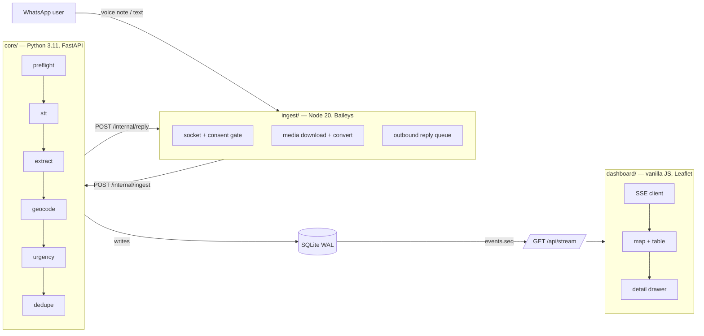
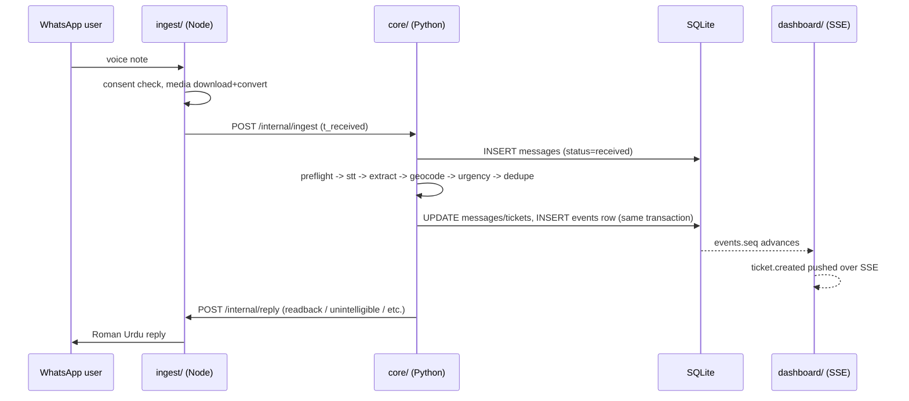

# Architecture

**Project:** Nidaa-AI
**Status:** Living document — update this when a module boundary or contract actually changes. It should never drift from what `main` does.
**Read this after:** [PRD](PRD.md), [TRD](TRD.md), [UI/UX Requirements](UI-UX-REQUIREMENTS.md)

This document exists so two people can build three runtimes in parallel without stepping on each other. It answers: what are the modules, who owns each one, what do they promise each other, and where are the seams you must never break without telling your teammate first.

---

## 1. The three runtimes, one contract

Nidaa-AI is three independent processes that only ever talk over the wire, never by importing each other's code:



**Why three processes and not one monolith:** the two people on this team own different runtimes (Node vs. Python) that would otherwise block on each other's build. Splitting on process boundaries, not just folders, means each side can restart, crash, or be rewritten without the other noticing anything except the HTTP contract.

**The one rule that keeps this working:** the API contract in [TRD §3](TRD.md#3-api-contract) and the DB schema in [TRD §2](TRD.md#2-database-schema-sqlite-wal) are **frozen on Day 1**. After that, a change to either requires updating this file and telling your teammate in the same message — never a silent breaking change, because the other runtime is being built against the contract, not against your code.

---

## 2. Module map and ownership

| Module | Runtime | Owns | Talks to | Suggested owner |
| :-- | :-- | :-- | :-- | :-- |
| `ingest/` | Node 20 (Baileys) | WhatsApp socket, consent ledger writes, media download/convert, all outbound message text and pacing | `core/` via HTTP only | Teammate A |
| `core/` | Python 3.11 (FastAPI) | Pipeline stages, queue + rate limiting, SQLite, SSE event log, HXL export | `ingest/` via HTTP (outbound replies only) | Teammate B |
| `dashboard/` | Static JS (no build) | Map, table, filters, TTT header, drawer, verdicts | `core/` via `GET /api/*` and SSE only, read-only + verdict POSTs | Whoever owns frontend for the session |
| `data/` | Static assets | Gazetteer, alias table, gold set | Read-only by `core/` | Data/eval owner |
| `tools/` | Python/Node scripts | Test audio generation, degradation, burst test, baseline stopwatch | Talks to `core/` and `ingest/` HTTP endpoints like an external client | Data/eval owner |

If it's just the two of you: one person owns `core/` + `data/` + `tools/` (the AI/pipeline track), the other owns `ingest/` + `dashboard/` (the product-surface track). That split minimizes cross-runtime context switching for each person and matches the PRD's team-roles table (§14) collapsed from four roles to two.

### 2.1 Hard rule: no cross-imports

`ingest/` never reads or writes `nidaa.db` directly — including for consent state. `dashboard/` never imports anything from `core/`. Every cross-module interaction is the HTTP contract in [TRD §3](TRD.md#3-api-contract), nothing else. This is what lets both of you develop against mocks before the other side's code exists (see §5).

This was a real gap in the original TRD (it said "check consent_ledger" without saying how, from a process that doesn't own the DB) — closed by adding `POST /internal/consent/check` and `POST /internal/consent/revoke` to the contract. See the addendum in [TRD §3.1](TRD.md#31-internal-node-daemon-to-python-core) if you're implementing either side of it.

---

## 3. `core/` internal structure (the pipeline)

```
core/
├── main.py            # FastAPI app: routes, SSE, startup (loads gazetteer, prompts)
├── config.py           # env var loading, one place, imported everywhere else
├── db.py                # SQLite connection, WAL pragmas, migrations, DAO functions
├── events.py            # append-only event log + SSE replay query
├── pipeline_queue.py    # asyncio.Queue + worker pool + token buckets (STT, LLM)
├── pipeline/
│   ├── preflight.py      # Stage 0: ffprobe duration + RMS gate
│   ├── stt.py             # Stage 1: Groq Whisper + confidence gate + escalation
│   ├── extract.py         # Stage 2: LLM structured extraction + Pydantic validation
│   ├── geocode.py         # Stage 3: alias -> exact -> fuzzy -> none cascade
│   ├── urgency.py         # Stage 4: max(model_urgency, rule_urgency)
│   └── dedupe.py          # Stage 5: (adm2, intent, item, 15-min bucket) key
└── prompts/
    ├── system_extract.txt # the extraction system prompt, versioned like code
    └── glossary.json       # idiom glossary, editable by a non-engineer
```

Each `pipeline/*.py` module is a **pure function of its stage's inputs to its stage's outputs** — it does not reach into `db.py` itself. `main.py`'s worker loop is the only place that reads a message, runs it through the stage functions in order, and writes results back through `db.py`. This is what makes each stage independently testable (feed `stt.py` a fixture audio file and assert on the confidence gate, without spinning up FastAPI or SQLite).

Stage order is fixed and each stage can only make the ticket's status move forward or fork it into a terminal failure state — never silently skip a stage. See the [error taxonomy in TRD §9](TRD.md#9-failure-and-error-taxonomy) for the exact fork points (`audio_unintelligible`, `failed`, `GEOCODE_NO_MATCH` → unlocated).

---

## 4. `ingest/` internal structure

```
ingest/
├── index.js         # entry point: transport-agnostic inbound handler (consent
│                    # gate, control keywords, POST /internal/ingest) + reply server
├── transports/
│   ├── whatsapp.js  # Baileys socket + pairing code + voice download (primary)
│   └── telegram.js  # Bot API long polling (dev/test transport — see note)
├── consent.js        # consent_ledger state machine: pending -> granted/revoked
├── outbound.js        # single reply queue, 1.5-3.0s jitter, global send cap
├── media.js            # ffmpeg convert to 16kHz mono wav (shared by all transports)
├── templates.js        # every outbound Roman Urdu string, one file (see TRD §6)
└── auth_state/          # Baileys credentials — gitignored, never commit
```

**Transport adapters (added Day 1).** `index.js` owns everything transport-independent; each module in `transports/` normalizes inbound messages into one shape (`endpointId`, `messageId`, `text`, `voice`) and exposes `sendText` + `downloadVoice`. `INGEST_TRANSPORT=whatsapp|telegram` in `.env` picks the transport. Telegram exists purely as a dev/test path — real end-to-end ingestion before the burner SIM is paired; WhatsApp remains the demo path, and `DEMO_MODE`'s simulator (TRD §10) is untouched. The `/internal/ingest` and `/internal/reply` contracts are unchanged: `wa_message_id` values are transport-scoped (`tg-<chat_id>-<message_id>` for Telegram, Baileys IDs for WhatsApp), which the TEXT UNIQUE column already accommodates.

`templates.js` is deliberately the only file that composes user-facing text. `core/` never sends Urdu copy — it only tells `ingest/` which template name and variables to use (`POST /internal/reply`). This keeps a copy-edit a one-file change and keeps outbound pacing in one place, so nobody can accidentally add a second send path that bypasses the jitter/rate cap.

---

## 5. Working in parallel without blocking each other

Both of you can start immediately, in parallel, against the frozen contract:

1. **Day 1 both people agree the schema (TRD §2) and API contract (TRD §3) are final for the week.** Any change after this point gets called out explicitly — don't just change a field name.
2. **`core/` owner** stands up FastAPI with the routes stubbed to return fixture JSON matching the contract, before the real pipeline exists. `ingest/` owner points their POSTs at this stub and builds/tests the Baileys side against it.
3. **`ingest/` owner** can also run `core/`'s `/internal/ingest` locally without a live WhatsApp session by using `tools/make_test_audio.py` + a raw `curl`/Postman POST — you do not need Baileys connected to test the pipeline, and you do not need the pipeline finished to test Baileys.
4. **`dashboard/` owner** builds entirely against `GET /api/tickets` and `GET /api/stream` mock responses (a static JSON file is fine for the first two days) since the dashboard has zero build step and zero dependency on the other two runtimes at runtime.
5. **`DEMO_MODE=true` + `POST /api/simulate`** (TRD §10) is not just a demo safety net — use it during development as the fastest way to inject a realistic ticket end-to-end without needing a phone at all.

The moment either of you needs to change something in TRD §2 or §3, edit `docs/TRD.md` in the same commit and mention it directly to the other person — do not let the two runtimes silently drift out of contract sync.

---

## 6. Data flow and timing instrumentation

Every message's lifecycle is timestamped at each transition, and TTT (the north star metric) is `t_published - t_received`, computed in SQL, never estimated client-side:



The `events` table is the single source of truth for the dashboard's state, including on reconnect: the client sends `Last-Event-ID`, the server replays `WHERE seq > ?` before resuming the live stream. Never push dashboard state through anything other than this event log — a second, ad hoc "notify the frontend" path is exactly how the reconnect-replay guarantee breaks.

---

## 7. Why SQLite, why no framework build step

Both choices are deliberate scope cuts for a 6-day build, documented here so nobody "fixes" them mid-week:

* **SQLite in WAL mode**, not Postgres: zero server to provision, and WAL mode gives concurrent dashboard reads while pipeline workers write. Revisit only in Phase 3 (see PRD §16) when multi-instance scale actually matters.
* **Dashboard has no bundler**: it must load from `file://` or a dead venue network. Do not introduce a build step, a framework, or an npm dependency graph on this module — that reintroduces the single failure mode the design explicitly avoids.
* **Rate limiting lives in `core/pipeline_queue.py` only**: both the STT and LLM token buckets are tuned below the documented free-tier ceilings (TRD §4.1). If you add a second place that calls Groq, it must acquire from the same bucket, or the whole point of the token bucket is defeated.

---

## 8. Extension points (Phase 2/3, do not build now)

Documented so a Day-3 "why don't we just add X" doesn't turn into scope creep. See [PRD §16](PRD.md#16-roadmap-beyond-the-mvp) for the full roadmap. The architecture is already shaped to make these additive, not rewrites:

* Semantic dedup (embeddings) replaces `dedupe.py`'s key-based cascade without touching any other stage.
* Union-council (`#adm3`) geocoding is a new tier in `geocode.py`'s cascade, slotted before the "no match" fallback.
* WhatsApp Business Cloud API migration replaces `ingest/index.js`'s transport only — the `/internal/ingest` and `/internal/reply` contract does not need to change.
* Postgres/PostGIS migration replaces `db.py` only, behind the same DAO function signatures. **The Postgres half of this was pulled forward for Render deployment** (see `docs/TRD.md` section 2's Postgres-support addendum) — `db.py` supports both SQLite and Postgres today, picked by `DATABASE_URL`. PostGIS, spatial clustering, and the live 3W feed (PRD §16) remain genuinely Phase 3.
